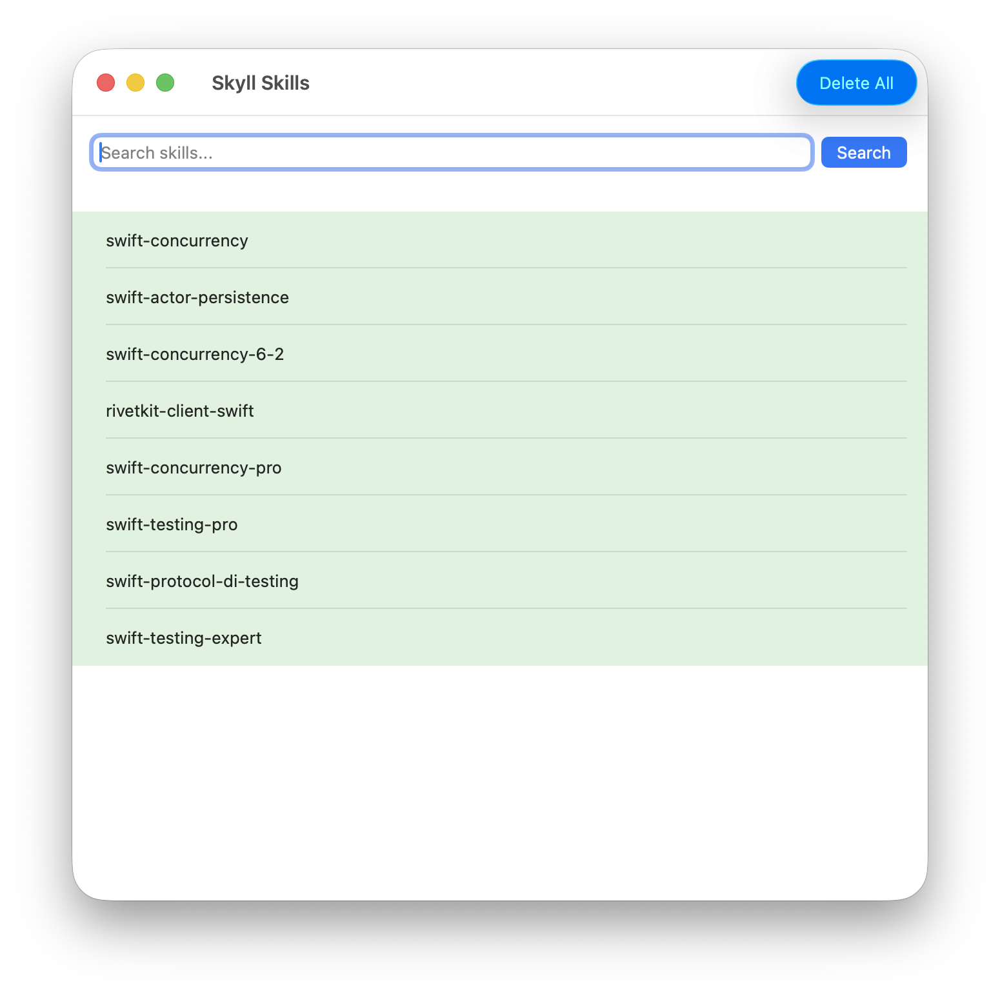
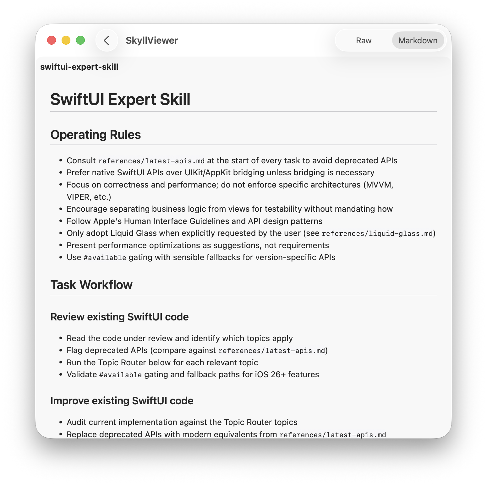

#  SkyllViewer

A demo of the [SkyllerKit](https://github.com/workingDog/SkyllerKit) library in a SwiftUI app searching for AI agents SKILL.

[SkyllerKit](https://github.com/workingDog/SkyllerKit) is a lightweight Swift package for searching and retrieving AI agent skills.
It is a Swift API interface to the skill discovery platform for AI agents [Skyll](https://www.skyll.app/).

     
      

## References

-   [Textual](https://github.com/gonzalezreal/textual) Render and customize rich attributed text in SwiftUI" used for markdown display.

-   [Skyll](https://www.skyll.app/) skill discovery for AI agents.
