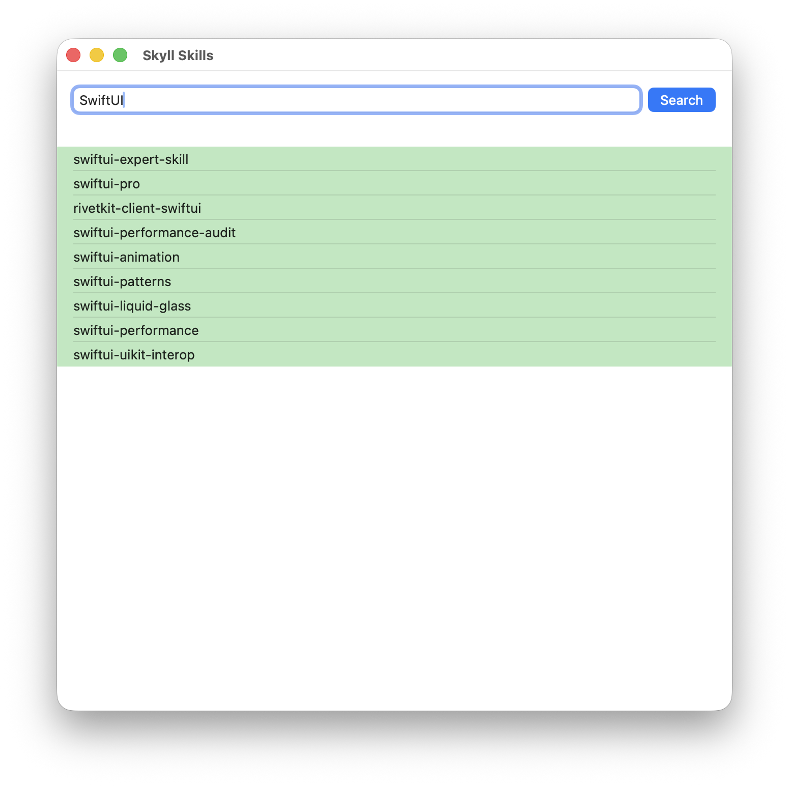

#  SkyllViewer

Using the [SkyllerKit](https://github.com/workingDog/SkyllerKit) library in a SwiftUI app to search for AI agents SKILL.

[SkyllerKit](https://github.com/workingDog/SkyllerKit) is a Swift interface to the  [Skyll](https://www.skyll.app/) "... a skill discovery platform for AI agents".

     
      

## References

-   [Textual](https://github.com/gonzalezreal/textual) "Render and customize rich attributed text in SwiftUI" used for markdown display.
